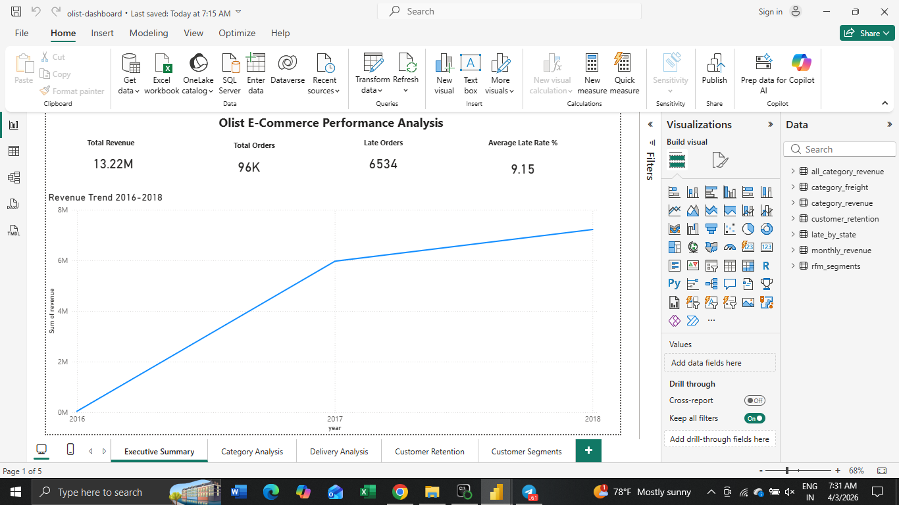
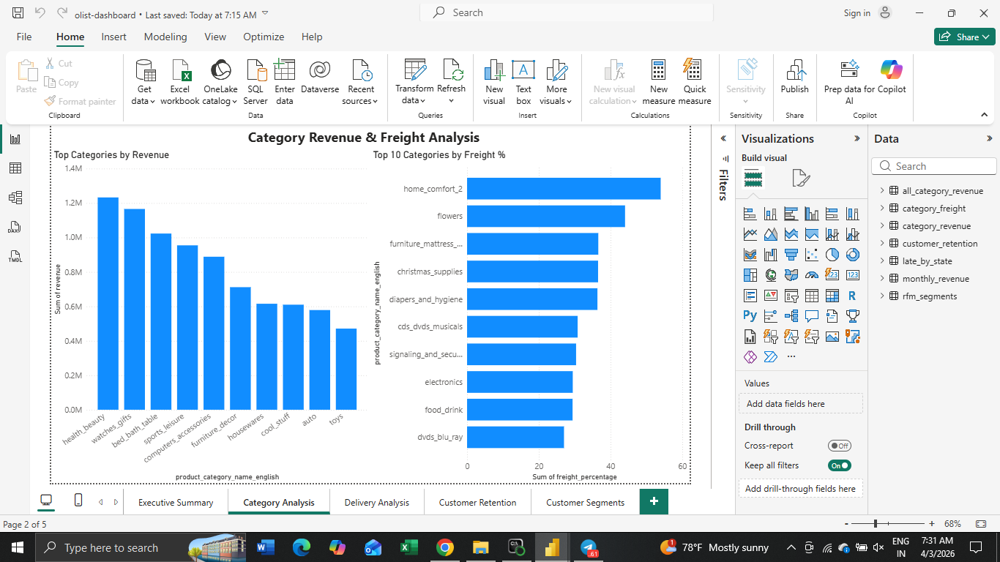
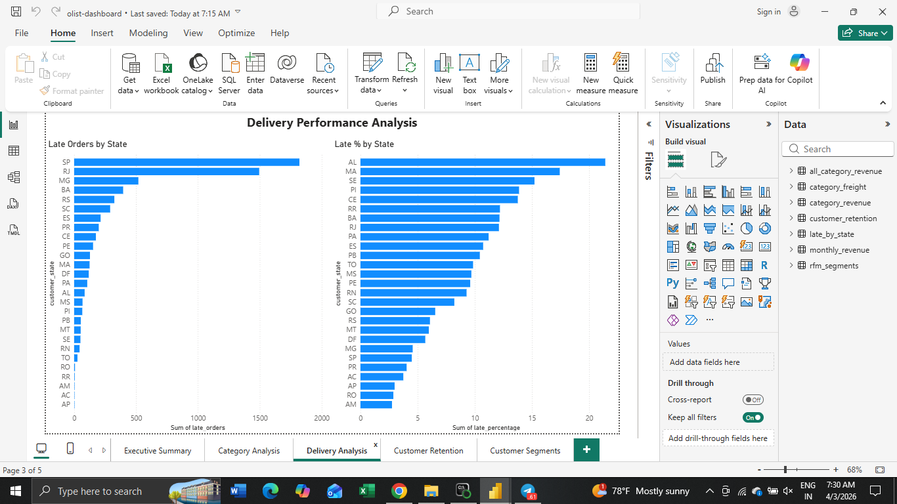
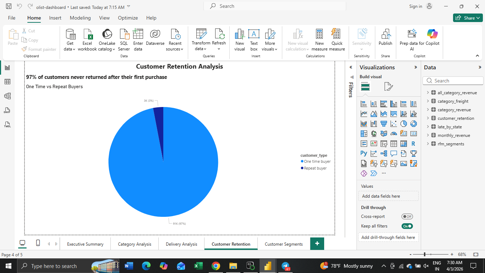
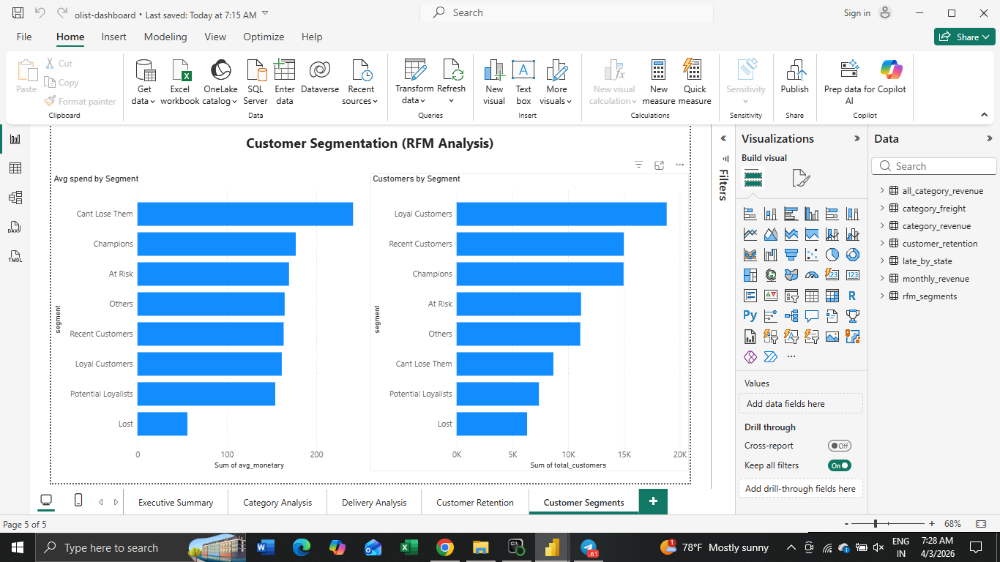

# Olist E-Commerce Business Analysis

## Project Overview
End-to-end data analysis of 100,000+ real orders from Olist, 
a Brazilian e-commerce platform. The goal was to identify 
revenue drivers, loss areas, delivery issues, and customer 
retention problems using SQL, Python, and Power BI.

## Business Problem
Olist needed to understand why revenue growth slowed in mid 
2018 and why customer retention was low despite high order 
volumes.

## Dashboard Preview

### Executive Summary

### Category Revenue & Freight Analysis

### Delivery Performance Analysis

### Customer Retention Analysis

### Customer Segmentation (RFM)

## Key Findings
- Total revenue from delivered orders: 13.22M BRL
- 97,242 BRL lost to cancelled and unavailable orders
- Health & Beauty is the top revenue category at 1.23M BRL
- Flowers and home comfort categories have 40-54% freight costs
- 6.77% of orders were delivered late
- Late delivery drops average review score from 4.29 to 2.27
- AL and MA states have 20%+ late delivery rates
- Only 3% of customers ever placed a second order

## Customer Segments (RFM Analysis)
- Champions: 14,961 customers — high recency, high frequency, high spend
- Loyal Customers: 18,824 customers — largest segment
- At Risk: 11,150 customers with avg spend of 169 BRL — need urgent retention
- Cant Lose Them: 8,671 customers with highest avg spend of 241 BRL — high value, declining activity
- Lost: 6,315 customers — gone, low spend, long inactive

## Business Recommendations
- Focus retention campaigns on At Risk and Cant Lose Them segments
- High freight costs in flowers and home comfort categories need logistics renegotiation
- Northeastern states AL and MA need improved delivery partnerships
- Late delivery is the single biggest driver of bad reviews and churn

## Tools Used
- Python (pandas) — data cleaning and analysis
- MySQL — data storage and SQL queries
- Power BI — dashboard and visualization
- Jupyter Notebook — analysis notebooks

## Project Structure
- 01_data_understanding.ipynb — initial data exploration
- 02_sql_analysis.ipynb — SQL connection and queries
- 03_final_analysis.ipynb — full analysis with all findings
- 04_rfm_analysis.ipynb — RFM customer segmentation
- olist_analysis_queries.sql — all SQL queries
- olist-dashboard.pbix — Power BI dashboard
- screenshots/ — dashboard preview images
- data/ — exported CSV files for Power BI

## Dataset
Olist Brazilian E-Commerce Dataset from Kaggle
9 tables, 100,000+ orders, 2016-2018